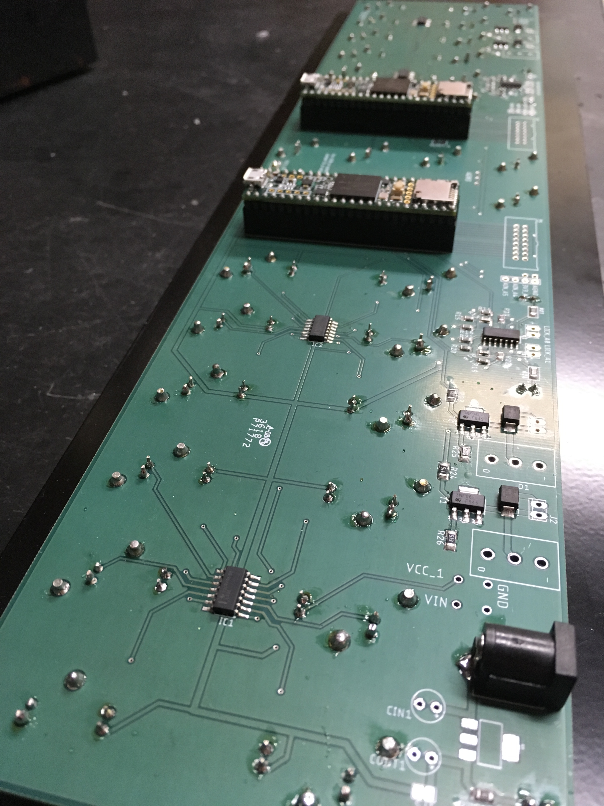
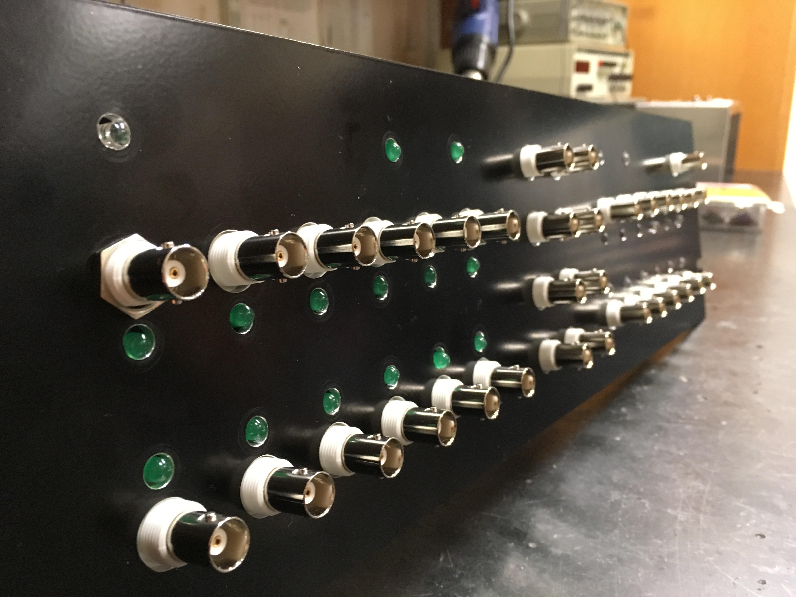

# Teensy-Breakout
Breakout board for 2x Teensys. Fits into 19" rack. Brings many IO pins to front panel BNC connectors. Includes solenoid drivers and comparator-based lick detection with hysteresis.

